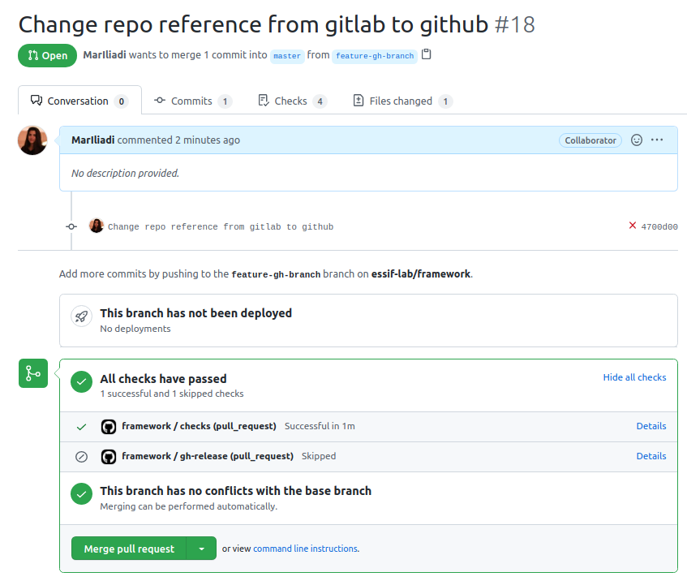
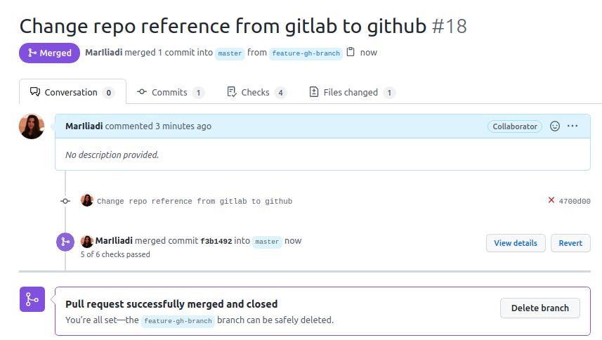
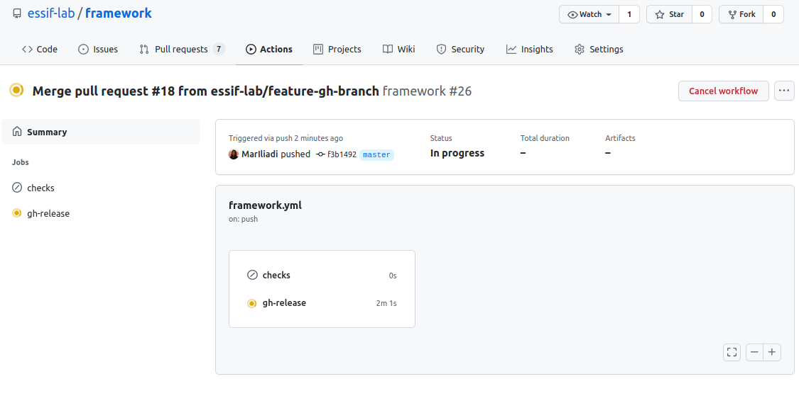

# eSSIF-Lab Framework

This repo contains files that are used to generate the the [eSSIF-Lab framework](https://essif-lab.github.io/framework) website, which includes the eSSIF-Lab vision, functional architecture, terminology and other relevant topics.

This website is generated using [Docusaurus 2](https://v2.docusaurus.io/) (and a custom plugin developed by [GRNET](https://grnet.gr/en/) for handling terminology).

## Writing Docusaurus Documents

Docusaurus requires documentation content to appear in `.md` files inside the `docs` folder.
Each file defines the following attributes at its very beginning:

- `id`, by which the file is referred to across the project
- `title`, appearing at the top of the file's display
- `sidebar_label`, the file's name appearing in the sidebar

Documentation on these and other header fields can be found [here](https://v2.docusaurus.io/docs/markdown-features#markdown-headers).

The Terminology Engine plugin of GRNET uses additional header fields. These are (or will be) defined [here](./docs/terminology-contributions).

The `sidebars.js` file contains the basic mechanism for [distributing content among sections](https://v2.docusaurus.io/docs/docs-introduction#sidebar) and is self-explanatory (compare with the sidebar appearing [here](https://essif-lab.github.io/framework/docs/essifLab-project)). Subsections within the `.md` file (that is, tagged with `##`) will appear at the right part of the page (see for example [here](https://essif-lab.github.io/essif-lab/docs/infrastructure)).

## Inserting Images in docs
<!-- **DEPRECATED** Images must be put inside the directory `static/images` and developers must refer to them using _relative_ urls.
Example: 
Docusaurus knows that the `../images` directory is inside the `static` directory, and thus process correctly.
The deployment pipe will convert `../images/` in such links to their _*absolute*_ urls.
Of course, if you want to link to images on the web, you can still use absolute urls. -->

If you want to add an image, say `example.png`, here is what you do:
- first, add the image to the `/static/images` directory (or `/static/images/subdir-path/`)
- then, in your document, add a line behind the docusaurus header that says: `import useBaseUrl from '@docusaurus/useBaseUrl';`
- next, in your document, at the place where you want the image to be presented, insert the following snippet:
```html

```
(or `src={useBaseUrl('images/subdir-path/example.png')}` if you added the image file there).

### Installation

You must be able to use `yarn` in order to run the local development server. If
you face an error similar to `ERROR: There are no scenarios; must have at least one`,
refer [here](https://github.com/yarnpkg/yarn/issues/2821) for a correct
re-installation of `yarn`.

### Local Development

```
$ yarn
$ yarn start
```

The first command is for linking dependencies. The second starts a local development server and opens up a browser window.
Note that not all browsers work with this - for example, Microsoft Edge doesn't work. Chrome and FireFox however do.
When developing, most changes are reflected live without having to restart the server.

### Build

```
$ yarn build
```

This command generates static content into the `build` directory and can be served using any static contents hosting service.

### Deployment via Github Pages

*GitHub Pages* provides hosting that comes for free with every GitHub repository.

The `master` branch has the latest changes to the content of the website.
> :exclamation: Avoid pushing changes directly to `master`. The best practice is to create a new branch, apply your changes and then merge the new branch to `master` once you make sure that it won't break the deployment of the website.

#### Workflow

The workflow in the framework repository, has the following jobs:
- `checks` [job](https://github.com/essif-lab/framework/blob/master/.github/workflows/framework.yml#L10): runs some checks, to make sure that the merged changes will not break the deployment

  These checks run on all the branches but `master`
- `gh-release` [job](https://github.com/essif-lab/framework/blob/master/.github/workflows/framework.yml#L25): takes care of the deployment
  
  The release job runs **only** when another branch gets merged to `master` and the changes affect the artifact of the deployment

> :exclamation: The branch that the website will be deployed to, defaults to `gh-pages`. The result of the release job (`build` directory)
> is stored in the `gh-pages` branch, so the developer should **not** apply changes directly to `gh-pages` branch. All changes must be merge
> to the `master` branch, and then the release job will start running automatically.

<details>
<summary>
In order to deploy a new version of the website, follow the procedure below:
</summary>

1. Create locally a new branch from `master` (ex. `feature-gh-branch` branch)
  
2. Add and commit your changes locally
  
3. Push your changes to the remote `feature-gh-branch` branch
  
4. To create a Pull Request to `master`, go to the repository's page on Github, in the [Pull requests tab](https://github.com/essif-lab/framework/pulls), and click `New pull request`
  
5. In the `compare:` dropdown list, choose the branch you want to merge with `master` (in this case with `feature-gh-branch`), and review the changes
  

  
Then, click `Create Pull Request` button to proceed
  
6. You will get prompted to the pull request page, where the *checks* of the PR are launched automatically, as part of the workflow
  

  
When the PR passes all the checks and it has no conflicts with the `master` branch, you can click the `Merge pull request` button, to merge the changes
  

  
Once the merging is over, the PR will change status from *Open* to *Merged*
  

  
7. In the [Actions page](https://github.com/essif-lab/framework/actions) you can review all the running workflows.
  

  
Now that the `feature-gh-branch` got merged to `master`, the release job started running, to update the website.
  


</details>

Once the job is completed, the new version of the website will be available here: https://essif-lab.github.io/framework/

The *Activity log* of the deployments is available here: https://github.com/essif-lab/framework/deployments/activity_log

## Terminology/Glossary plugin usage

This project has a plugin integrated that can generate terms in a useful way so contributors can write a special syntax to reference terms and generate a glossary based on those terms.

This plugin is designed to work in the pre-build stage.dc up  This means, it is strongly suggested that you do **not** run manually
the script in your local computer (or at least do not commit changes). In order to view the final result, you can instead use
Docker and/or Docker Compose, as follows.

#### Docker

You can run the following commands to see the output of the website, just as it will look like when deployed to a production environment:

```
docker build -t eSSIF-Lab-terminology:latest .
docker run -ti -p 5000:5000 eSSIF-Lab-terminology:latest
```

You can then visit http://localhost:5000 to view the website

To stop docker from running, you can just hit `ctrl+c` in the terminal window.

#### Docker Compose

Docker Compose is a wrapper of docker, so you can run less commands to do the same job as you would do with docker commands. You only need to run:

```
docker-compose up --force-recreate --build
```

and then visit http://localhost:5000 to view the website.

To stop docker-compose, just like docker, hit `ctrl+c` in the terminal window.

## Terminology/Glossary plugin explanation

### How it works

This plugin parses docs in two ways:

  1. Parses all `*.mdx` files under `docs/` and replaces each pattern with an
  appropriate React component supporting a tooltip functionality (see below)
  2. Generates a glossary with all terms corresponding to the `*.md` files under `docs/terms/`.

Parses all markdown files and generates a glossary page with all the pattern terms found in the .md files

### Replace patterns with dynamical elements

When writing docs, in order to refer to a term, you may use the following syntax:

```
%%term_text|term_name%%
```

where:
- `term_text`: The terminology text you want it to be visible in the documentation
page
- `term_name`: The filename of the term file, which resides under `./docs/terms` directory.

inside `docs/*.mdx` files. After successfully running the script, the above occurrence
will be replaced by a React component, which will render `term_text` as a link to the
corresponding term page, which is in turn generated from the `term_name` attribute;
furthermore, *hovering* over `term_text` displays a term summary, as extracted from the
corresponding term page.

### Example usage

Say you want to reference a term that exists under the `./docs/terms/` directory,
e.g. `./docs/terms/party.md`. You can use the following syntax to reference
this term in your documentation page:

```m
Some content that wants to reference the %%party|party%% term
```

When the script runs, this will be replaced as follows:

```html
Some content that wants to reference the <Term reference="party" popup="hovertext provided in the party.md file">Party</Term> term
```

which supports the functionality explained above.

### How to correctly write a term

This plugin assumes that you follow the structure, as explained below:

Each term should have its own `.md` file, inside the `./docs/terms` directory. For example, you can define the term `term` in file `term.md`, which would then exist as `./docs/terms/term.md`.

These files must have the following structure:

```md
---
id: term
title: Term page
hoverText: "This text will appear as a popup when the term is referenced in a documentation page."
glossaryText: "This text will appear as a description of the term in the glossary that is generated."
date: 20210601
---

### Term explanation

content here
```

>Pay attention to the `hoverText` attribute, as it's important to provide this
>attribute (along with the default docusaurus attributes), so the plugin can
>fetch the correct popup text to show when referencing a term.
>The `hoverText` MUST NOT contain %%-references!

>The `glossaryText` attribute may contain references to (other) terms,
>but, for technical reasons, the syntax is slightly different:
>You should write `%%term text^term-name%%` (i.e. not use the `|`
>character as in  `%%term text|term-name%%`

### Running the script

When you are finished referencing terms and have written corresponding term pages,
you can test this locally by running the following command:

```.shell script
$ yarn parse
yarn run v1.22.5
 docusaurus parse
Replacing patterns with <Term />
Done in 1.41s.
```

This will replace all `%%term_text|term_name%%` occurrences with the React component
supporting the required functionality.

### Generate the glossary page

If everything works well with the above procedure, you can then generate a
glossary page, by running the following command:

```.shell script
$ yarn glossary
yarn run v1.22.5
 docusaurus glossary
Alphabetical list of terms
Done in 1.53s.
```

This will generate a file in `./docs/glossary.md` where every term that has been
mentioned above, will be populated in the `glossary.md` page.
